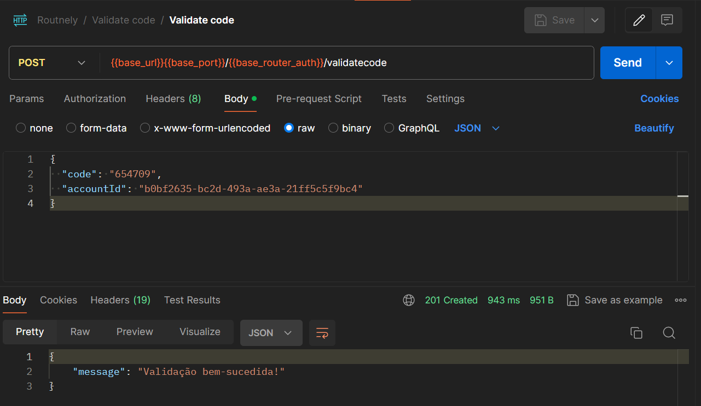

# Documentação sobre o processo de redefinição de senha no Routnely

Neste documento você encontrará informações detalhadas sobre como usar o serviço de `redefinir senha` no Routnely.

---

⚠️ **Insira os dados do seu usuário cadastrado para realizar os testes na aplicação.**

---

- Se autentique fazendo login na aplicação

```http
POST /auth
```

```json
{
  "email": "routnely@email.com",
  "password": "@exemple",
  "remember": true
}
```

[](assets/image01.png)

(imagem 01 - clique na imagem para ver maior) |

---

- Solicite a redefinição de senha informando o `email` na rota `auth/resetpassword`

```http
POST /auth/resetpassword
```

```json
{
  "email": "routnely@email.com"
}
```

[](assets/image02.png)

(imagem 02 - clique na imagem para ver maior) |

Ao obter um retorno 201 na requisição, salve o `accountId`, precisaremos dele posteriormente.

---

Após solicitação no `resetpassword`, verifique o código recebido por e-mail.

- Acesse `mailtrap.io` e faça login.

[](assets/image03.png)

(imagem 03 - clique na imagem para ver maior) | Tela de home do Mailtrap

---

Acesse `My Inbox`

[](assets/image04.png)

(imagem 04 - clique na imagem para ver maior) | Tela de inbox

Ao chegar no Inbox, localize o e-mail informado que contém o código.

---

- Para validar o código recebido vá até a rota `auth/validatecode` e informe o `code` e o `accountId`

```http
POST /auth/validatecode
```

```json
{
  "code": "123456",
  "accountId": "string-accountId"
}
```

`Em caso de sucesso:`

[](assets/image05.png)

(imagem 05 - clique na imagem para ver maior)

`Em caso de erro:`

[](assets/image-error.png)

(imagem de erro - clique na imagem para ver maior)

---

- Após o código ser validado, insera o mesmo código na rota `auth/changepassword` para efetivar a mudança de senha

Será necessário informar o `password` (a nova senha desejada), o `code` e o `accountId` do seu usuário

```http
PUT /auth/changepassword
```

```json
{
  "password": "nova-senha",
  "code": "123456",
  "accountId": "string-accountId"
}
```

[](assets/image06.png)

(imagem 06 - clique na imagem para ver maior)

---

Após todos os passos citados acima, a sua nova senha já teria sido redefinida.

Realize o login novamente com a nova senha criada.
